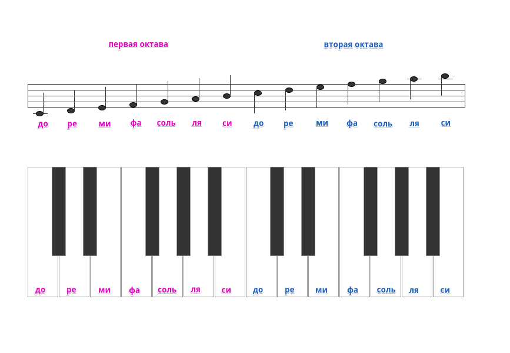
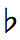

## Сами [Задачи](https://contest.yandex.ru/hiring/contest/10824/enter/) на Yandex 2018 Год

## 2E. Концерт оркестра

Представьте, что вы музыкант в большом оркестре. Через час у вас начнётся концерт. Большой зал, много зрителей.

Пять минут назад выяснилось, что заболел пианист. Это ужасно — придется отменять концерт и возвращать деньги за билеты.

К счастью, вы знаете JavaScript и предлагаете написать программу, которая по нотам исполнит партию фортепьяно. Это может спасти ситуацию!

Пожалуйста, напишите программу. Остальные музыканты будут вам очень благодарны.

**Примечания**

Откройте HTML-файл тестовой страницы с фортепьяно по ссылке «Скачать условие задачи» в конце описания.

Вам нужно написать программу на JavaScript, которая исполнит партию пианиста по нотам, написанным вверху тестовой страницы. Если клавиши нажаты правильно, должно появиться сообщение «You win!».

При проверке, файл с вашим решением будет подключен на тестовую страницу в место, обозначенное комментарием:  

```html
<!-- подключите свой скрипт здесь -->  
<!-- <script src="solution.js"></script> -->
```

Обратите внимание, ваше решение будет тестироваться в браузере **Google Chrome 69**.

Сообщение "IL"(превышено время ожидания действия) в поле «Вердикт», при проверке решения, означает, что за отведённое для теста время не были нажаты правильные клавиши. 

**Какими клавишами играть ноты:**



**Подсказки:**

- знак  повышает ноту на полтона (нужно нажимать соседнюю черную клавишу справа от ноты)
- знак  понижает ноту на полтона (нужно нажимать соседнюю черную клавишу слева от ноты)

[Скачать условие задачи](https://contest.yandex.ru/hiring/contest/10824/download/2E/)