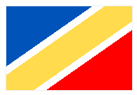

## Сами [Задачи](https://contest.yandex.ru/hiring/contest/10824/enter/) на Yandex 2018 Год

## 3C. Картинка с заданной вариативностью




Дизайнер разработал логотип. Его потребуется использовать в самых разных условиях. Чтобы это было максимально удобно, сверстайте его с помощью одного HTML-элемента на чистом CSS.

Использовать картинки (даже через data:uri) нельзя.

**Примечания**

- Ширина: 180px
- Высота: 120px
- Плюс рамка: однопиксельная, #efefef.
- Цвета флага: #0054b9, #fff, #ffdb4d, #f00.
- Угол наклона: 145 градусов.

>Решение нужно предоставить в виде CSS-файла.
Ваш файл будет подключен как solution.css к HTML-странице вида:

```html
<!DOCTYPE html>  
<html>  
    <head>  
        <meta http-equiv="Content-Security-Policy" content="default-src ’self’; style-src ’unsafe-inline’ ’self’"/>  
        <style>  
            div {  
                width: 180px;  
                height: 120px;  
            }  
        </style>  
        <link rel="stylesheet" href="solution.css">  
    </head>  
    <body>  
        <div></div>  
    </body>  
</html>
```