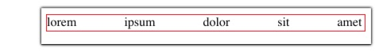

## Сами [Задачи](https://contest.yandex.ru/hiring/contest/10824/enter/) на Yandex 2018 Год

## 3D. WYSIWYG-редактор

Вы с Катей разрабатываете новый, быстрый WYSIWYG-редактор с применением последних фреймворков. Сейчас стоит задача сделать выравнивание текста в блоке. Слева, Справа и По центру удалось легко сделать, однако с форматированием По ширине возникли трудности. Напишите функцию, которая будет возвращать то значение для свойства word-spacing, с которым строка текста в блоке будет занимать весь блок и не вылезать за его границы, а значение свойства word-spacing будет максимальным. Если же это не удаётся сделать, то решение должно возвращать null. Максимальная длина строки на вход - 100 символов. Ещё, входная строка не может быть пустой. Ваше решение должно содержать код функции целиком и не использовать внешних зависимостей, чтобы Мелисса не рефакторила код ещё раз для интеграции решения. Визуальный редактор должен работать быстро, поэтому мы будем проверять, насколько оптимально работает ваше решение, и штрафовать его, если оно производит слишком большое количество манипуляций с DOM.

Предполагается, что во входной строке всегда несколько слов (два и более).

**Заготовка функции**

Ваше решение должно содержать функцию, соответствующую следующей сигнатуре:

```javaScript
/***  
 * @param container {Node} ссылка на DOM-node, в которую нужно вписать строку ‘str‘  
 * @param str {string} строка, которую необходимо вписать. Максимальная длина равняется 100 символам  
 * @param min {number} минимальный размер свойства word-spacing (целое число)  
 * @param max {number} максимальный размер свойства word-spacing (целое число)  
 * @return {number | null} вычисленный размер свойства word-spacing (целое число) или null, если вписать нельзя  
 */  
function computeWordSpacing (container, str, min, max) {  
  // ваш код  
}
```

**Примеры**

**Пример №1**

Для такого контейнера:

```html
<div id="container" style="width: 400px;height: 20px;font-size: 16px;"></div>
```

и таких входных параметров

computeWordSpacing(document.getElementById(’container’), ’lorem ipsum dolor sit amet’, 10, 100)
функция должна вернуть <b>56</b> (на вашем компьютере это число может быть другим из-за различий в отрисовке шрифтов).




Среда исполнения

Ваше решение будет тестироваться в браузере Google Chrome версия.


**Формат ввода**

Функция получает на вход HTML элемент, строку, минимальное значение свойства и максимальное значение свойства.

**Формат вывода**

Функция должна вернуть число, которое соответствует значению свойства word-spacing

**Примечания**

Ваше решение будет тестироваться в браузере **Google Chrome 69**.

Если ваше решение проходит не все тесты, то оно может

- возвращать неправильный ответ в каких-то случаях
- выполнять слишком много манипуляций с DOM
- неправильно обрабатывать входные данные.