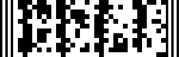

## Сами [Задачи](https://contest.yandex.ru/contest/14225/enter/) на Yandex 2019 Год

## C. Отладка кофемашины (40 баллов)

Программист Фёдор Ракушкин разрабатывает умную кофемашину. Он столкнулся с проблемой: у кофемашины нет разъема, через который можно подключиться отладчиком. Если что-то сломалось или зависло, хочется иметь возможность быстро получить отладочную информацию.

У кофемашины есть небольшой чёрно-белый дисплей размером 300 на 96 пикселей. Фёдор придумал следующую схему: когда что-то ломается, кофемашина выводит на дисплей баркод с закодированной отладочной информацией.

Помогите Фёдору реализовать функцию, которая будет рендерить баркод с отладочной информацией по придуманному Фёдором алгоритму.

**Формат отладочной информации ПО кофемашины**

Кофемашина генерирует отладочную информацию в виде объекта следующего вида

```javascript
type CoffeeMachineDebugInfo = {  
    /**  
     * Идентификатор конкретной кофе-машины — строка из маленьких  
     * и больших латинских букв и цифр, строго 10 символов  
     */  
    id: string;  
    /**  
     * Код ошибки — целое число от 0 до 999  
     */  
    code: number;  
    /**  
     * Сообщение об ошибке — строка из маленьких и больших  
     * латинских букв, цифр и пробелов (от 0 до 34 символов)  
     */  
    message: string;  
}
```

**Алгоритм отрисовки баркода**

Баркоды, которые придумал Фёдор, выглядят так: 



Баркод имеет фиксированный размер (по экрану кофемашины) — 300 на 96 пикселей. С левого и правого края баркод ограничен пятью полосками (чёрная, белая, чёрная, белая, чёрная). Ширина чёрной полоски — 4 пикселя, белой полоски - 5 пикселей.

Между полосками находится контент баркода, закодированный чёрными и белыми квадратами, состоящий из 12 строк по 32 квадрата в каждой строке. Размер каждого квадрата — 8 на 8 пикселей.

Белые квадраты в контенте кодируют 0, чёрные — 1.

**Алгоритм формирования контента баркода**

Из отладчной информации формируется строка вида `<id><code><message>`. Поле code дополняется незначащими нулями до трех символов. Поле message дополняется пробелами в конце до 34 символов.

Далее строка конвертируется в байтовый массив - каждому символу строки ставится в соотвествие его ASCII-код (число от 0 до 255). В конец массива дописывается один байт контрольной суммы, которая вычисляется как побитовое сложение по модулю 2 (XOR) всех элементов массива.

Затем, каждый элемент полученного массива переводится в двоичную запись (восемь сивмолов 0 или 1) и кодируется последовательностью из восьми квадратов (0 - белый квардрат, 1 - черный квадрат). Квадраты отрисовываются в контенте баркода последовательно и построчно.

**Формат решения**

В качестве решения предоставьте файл, содержащий функцию renderBarcode:

```javascript
/**  
 * Отрисовать отладочную информацию кофемашины в element  
 * @param debugInfo {CoffeeMachineDebugInfo} - отладочная информация  
 * @param element {HTMLDivElement} - div с фиксированным размером 300x96 пикселей,  
 *     в который будет отрисовываться баркод  
 */  
function renderBarcode(debugInfo, element) {  
    // ваш код  
}

```

Решение будет запускаться в браузере Google Chrome 77.

**Примеры**

Отладочная информация:

```javascript
{  
     "id": "ezeb2fve0b",  
     "code": 10,  
     "message": "404 Error coffee not found"  
}
```

Баркод:

.png)

Отладочная информация:

```javascript
{  
    "id": "Teapot1234",  
    "code": 0,  
    "message": "No coffee this is a teapot"  
}
```

Баркод: 

.png)